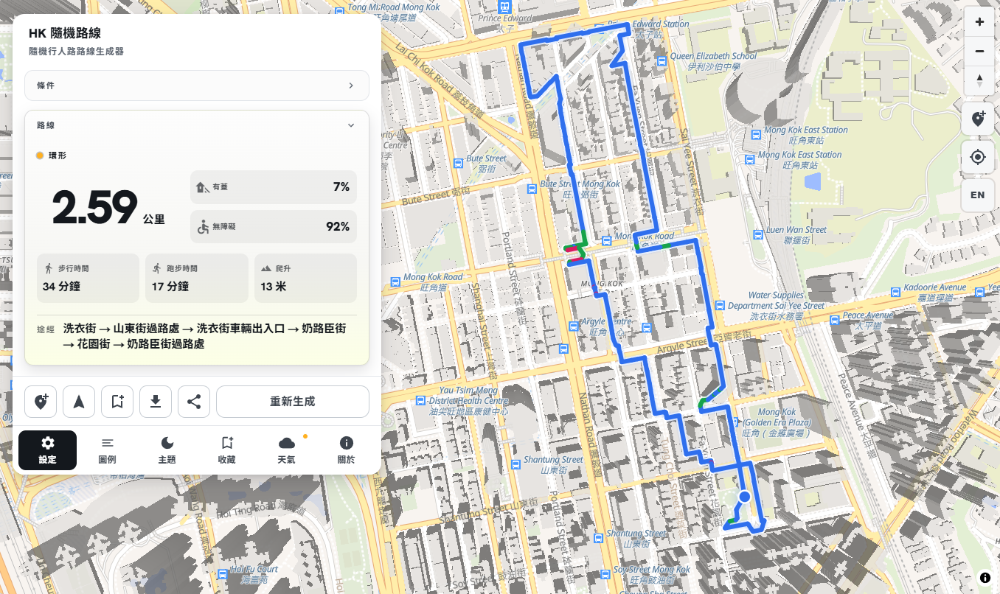
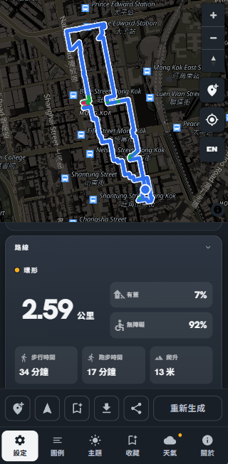

# HK 隨機路線 · HK Random Route

A web app that generates random jogging and walking routes over the **HK 3D Pedestrian Network**, filtered by your criteria. Pick an origin, choose a distance and route preferences, and get a random loop, one-way, or out-and-back route you can follow live, export as GPX, or share with a link.

> Visit the live app [here](https://hk-random-route.vercel.app/).

<p align="center">
  
  
</p>

## Features

- **Criteria-based generation** — target distance (0.5–50 km), covered, barrier-free, flat, loop
- **Three route types** — loop (returns to the origin without repeating a segment), one-way, and out-and-back as a fallback
- **Random walks with tolerance** — distance always reaches the target (never under it, up to +10% over), widening to +15% / +25% when nothing fits; regeneration never repeats the previous route
- **Live follow mode** — browser GPS with on/off-route detection, current street name, and next-segment highlight
- **GPX export** — load routes into external device or apps
- **Share links** — the route is compressed into the URL hash, making it shareable easily
- **Local persistence** — bookmarked origins and a 30-day history of saved routes
- **Weather warnings** — live HKO warning messages
- **Theme switching** — light and dark theme switching

## Getting started

Requires [Node.js](https://nodejs.org) 20.9 or newer.

```bash
git clone https://github.com/justintse-cal/hk-random-route.git
cd hk-random-route

npm install
npm run dev
```

Open [http://localhost:3000](http://localhost:3000). The app loads a committed binary graph asset (`public/graph.bin`, ~20 MB), so no Python or geodatabase is needed to run it.

## How it works

The client calls a serverless API that runs a filter-aware random walk over the pedestrian network:

1. The chosen origin is **snapped** to the nearest network node on a segment satisfying the active criteria (within ~500 m), or a clear "no compliant segment" error is returned.
2. A seeded, self-avoiding random walk accumulates length over compliant segments until it reaches the distance tolerance band (at least the target, at most +X% over) — closing back to the origin for a loop, or ending at a random node for a one-way route.
3. The result is returned as a GeoJSON route with metadata (distance, elevation gain, walk/run duration, type badge, per-segment street names and covered/flat flags) and rendered by MapLibre.

The network is fragmented into 476 connected components, so generation is always constrained to the component the origin lands in.

## Building the graph asset from the geodatabase

Route generation runs against a compact, memory-mappable binary graph built from it in advance.

### Prerequisites

Python 3 with the data stack:

```bash
pip install numpy pyogrio pyproj shapely   # pyogrio bundles GDAL
```

### Build

```bash
npm run build:graph            # reads 3DPN_P2.gdb, writes public/graph.bin
# equivalent:
python scripts/build_graph.py 3DPN_P2.gdb -o public/graph.bin
```

The script (`scripts/build_graph.py`) reads the `PedestrianRoute` layer of the file geodatabase (ESRI File GDB, EPSG:2326 HK80 grid + HKPD heights — 465,475 segments) and:

1. **Nodes** — dedupes segment endpoints into nodes and reprojects them from HK80 to WGS84.
2. **Components** — runs union-find over edges to assign each edge a connected-component id.
3. **Filter masks** — encodes each edge's criteria semantics into a bitmask: outdoor/indoor (`Location`), covered (`WeatherProof`), barrier-free (`WheelchairBarrier` not flagged), flat (`Gradient` < 0.1).
4. **Name pools** — dedupes street names into NUL-separated UTF-8 string pools for TC and EN.
5. **Spatial index** — buckets edges into a coarse ~100 m grid (by edge midpoint) so origin snapping stays fast.
6. **Serialization** — writes a little-endian binary file: a 100-byte header (magic `HKGR`, format version 1, section offsets) followed by node lat/lon tables, 28-byte edge records, the grid index, and the name pools (~20 MB in total).

At runtime `lib/graph.ts` reads the file directly into typed-array views over the buffer (no parsing), and `lib/server-graph.ts` caches the loaded graph per serverless instance.

## Project structure

```
app/            Next.js app router: page, layout, styles, UI components
app/api/        Serverless routes: generate, snap, weather
lib/            Route generator, graph loader, follow, gpx, share, storage, i18n
scripts/        build_graph.py — geodatabase → binary graph
public/         graph.bin and static assets
screenshots/    README images
docs/           spec and agent docs
3DPN_P2.gdb/    Source geodatabase (not tracked; see .gitignore)
```

## API

| Endpoint | Method | Purpose |
| --- | --- | --- |
| `/api/generate` | POST | Generate a route from `{ origin, targetDistanceM, criteria }`, optionally excluding previous segments |
| `/api/snap` | POST | Snap a coordinate to the nearest compliant network node |
| `/api/weather` | GET | Proxy HKO weather warnings (avoids browser CORS) |

Both generation endpoints run on the Node.js runtime, load `public/graph.bin` via the cached server graph, and are capped at a 30-second duration.

## Testing

```bash
npm test
npm run typecheck
```

The suite covers the generation contract over the real graph (tolerance bands, loop closure, segment compliance, no-immediate-repeat), snapping, share-link round-tripping, follow geometry, GPX export, i18n parity, persistence, the weather proxy, and a light end-to-end UI flow.

## Data

- **Route network data:** [HK 3D Pedestrian Network](https://data.gov.hk/en-data/dataset/hk-landsd-openmap-3d-pedestrian-network), provided by the Lands Department of Hong Kong.
- **Weather Warning:** Hong Kong Observatory (HKO) warning data from [current weather report](https://data.gov.hk/en-data/dataset/hk-hko-rss-current-weather-report).
